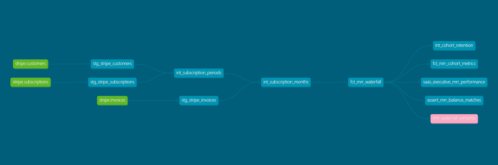
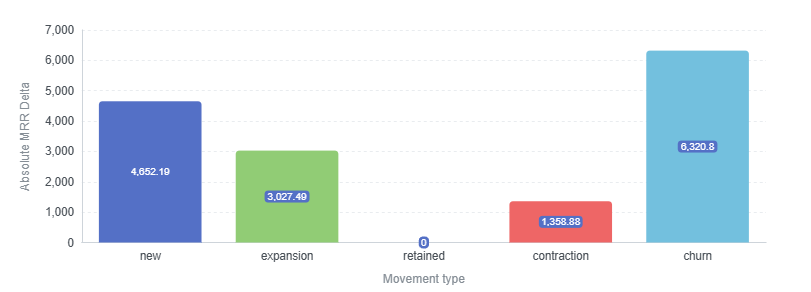

# B2B SaaS Revenue & Subscription Analytics Engine

A multi-warehouse Analytics Engineering pipeline built with **dbt Core**, **DuckDB / MotherDuck**, **Google BigQuery**, **MetricFlow**, and **Lightdash**[cite: 19, 23]. 

This repository processes raw Stripe subscription event streams into automated B2B SaaS revenue models, calculating Monthly Recurring Revenue (MRR) movement waterfalls, customer retention cohorts, and revenue dynamics[cite: 21, 23].

---

## Architecture & Data Lineage

The pipeline employs a three-tier modular architecture (`staging` ➔ `intermediate` ➔ `marts`)[cite: 23]:

1. **Staging (`staging`)**: Cleans, renames, and types raw Stripe event records (`customers`, `subscriptions`, `invoices`)[cite: 23].
2. **Intermediate (`intermediate`)**: Constructs customer-month spine models, resolves subscription date overlaps, and derives lagged prior-month MRR[cite: 23].
3. **Marts (`marts`)**: Exposes presentation-ready analytical tables and semantic models[cite: 23]:
   * `fct_mrr_waterfall`: Categorizes month-over-month MRR movement into `new`, `expansion`, `contraction`, `churn`, and `retained`[cite: 21, 23].
   * `fct_mrr_cohort_metrics`: Computes cohort retention schedules and revenue retention trajectories[cite: 23].
   * `mrr_waterfall_semantic`: Integrates MetricFlow semantic metrics with Lightdash BI[cite: 19, 23].

### Complete DAG Lineage Graph



---

## Key Business Metrics & Visualizations

The primary fact model computes MRR balance movements across reporting periods[cite: 21, 23]. Metric parity is verified between local development (`MotherDuck`) and production (`Google BigQuery`)[cite: 23].

### Revenue Movement Accounting Equation
$$\text{MRR}_{\text{Ending}} = \text{MRR}_{\text{Beginning}} + \text{New} + \text{Expansion} - \text{Contraction} - \text{Churn}$$

* **New**: First subscription month for an onboarding account[cite: 21].
* **Expansion**: $\text{MRR}_{\text{Current}} > \text{MRR}_{\text{Prior}} > 0$[cite: 21].
* **Contraction**: $0 < \text{MRR}_{\text{Current}} < \text{MRR}_{\text{Prior}}$[cite: 21].
* **Churn**: $\text{MRR}_{\text{Current}} = 0$ while $\text{MRR}_{\text{Prior}} > 0$[cite: 21].
* **Retained**: $\text{MRR}_{\text{Current}} = \text{MRR}_{\text{Prior}} > 0$[cite: 21].

### Lightdash Executive Visualization



---

## Data Quality & Automated Assertions

Pipeline integrity is protected via custom dbt assertions and automated tests[cite: 23]:

* **MRR Balance Reconciliation**: `assert_mrr_balance_matches.sql` validates that month-over-month aggregated deltas match calculated movement categories[cite: 23].
* **Primary Key Uniqueness**: Enforced via `not_null` and `unique` assertions on key dimensions[cite: 23].

---

## Quickstart & Execution

### 1. Environment Setup
```bash
python -m venv dbt-env
source dbt-env/Scripts/activate  # On Windows Git Bash
pip install dbt-duckdb dbt-bigquery