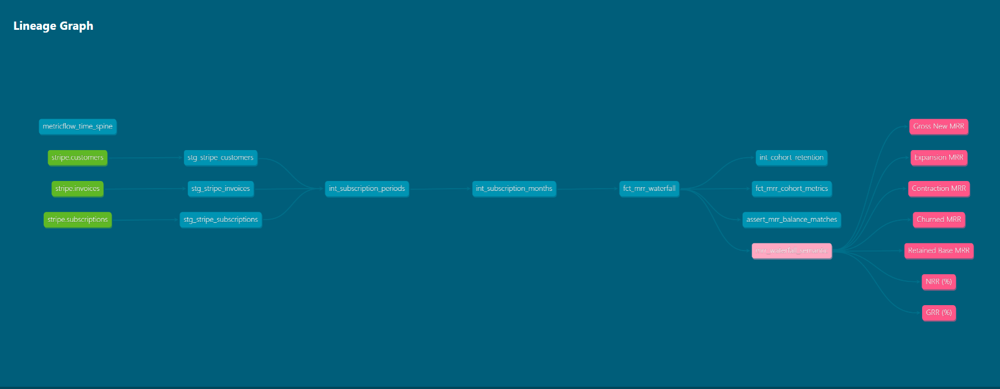

## 📊 Business Intelligence & Semantic Layer (MetricFlow + Lightdash)

This repository enforces **BI-as-Code** by defining business metrics centrally in dbt MetricFlow (`mertic.yml`) and exposing them to Lightdash for headless querying.

### 1. Key Business Metrics Exposed
* **Gross New MRR**: Sum of new subscription monthly recurring revenue.
* **Expansion & Contraction MRR**: Net expansion or downgrade deltas across active accounts.
* **Net Revenue Retention (NRR)**: Benchmark tracking revenue expansion against churned/contracted revenue.

### 📂 Project Directory Structure

* **`models/`**: Production dimensional model transformations (Staging, Intermediate, Marts).
* **`analyses/`**: Compiled ad-hoc executive SQL queries for one-off KPI auditing (e.g., MRR churn summaries) without creating database tables.
* **`tests/`**: Singular automated financial reconciliation assertions.

## 📊 Business Intelligence & Semantic Layer (Lightdash)

This repository follows **BI-as-Code** principles. Metrics and semantic definitions configured in dbt are automatically synced and version-controlled with Lightdash.

### MRR Movement Waterfall Chart
Below is the compiled Lightdash visualization generated from `fct_mrr_waterfall`:


### Sync & Deploy Commands
```bash
# Export saved Lightdash charts to local code repository
lightdash download

# Compile project lightdash metadata locally
lightdash compile

## 🏗️ Data Architecture & Star Schema Lineage Graph

The pipeline relies on a 3-tier dimensional modeling framework:
* **Staging Layer (`stg_`)**: Standardizes raw Stripe entities (`subscriptions`, `customers`, `invoices`).
* **Intermediate Layer (`int_`)**: Expands subscription periods into monthly grains and executes LAG windowing for historical baseline tracking.
* **Marts Layer (`fct_`)**: Dimensional star schema facts driving downstream SaaS BI metrics, cohort retention, and MRR reconciliation.

### Complete dbt Lineage Graph (DAG)





---
## 🧪 Financial Data Testing & Reciprocity Auditing

To maintain production-grade data integrity, the pipeline implements automated singular financial reconciliation assertions:

* **Audit Test**: `tests/assert_mrr_balance_matches.sql`
* **Assertion Logic**: Verifies that `Current MRR - Previous MRR = MRR Change` across all account snapshot months. Returns variance alerts if delta exceeds $0.01 floating-point tolerance.

```bash
# Execute financial audit assertion
dbt test --select assert_mrr_balance_matches

---

## 📊 Analytics & Financial Reconciliation Methodology

* **MRR Waterfall Logic**: Tracks subscriber movements across monthly snapshots to quantify Gross New, Expansion, Contraction, and Churned MRR.
* **Cohort Retention**: Groups accounts by start-month cohort to evaluate long-term Net Revenue Retention (NRR) and Churn rates.
* **Automated Audit Assertion**: Enforces $0.01 mathematical reciprocity between historical base MRR and net periodic adjustments via `assert_mrr_balance_matches.sql`.